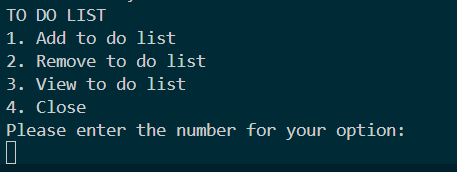

# ToDoListApp

## Description

`ToDoListApp` is a simple Java application that allows users to manage their tasks using a command-line interface. With this application, users can add new tasks, remove current tasks, and view the current list of tasks created.

## Features

>>>>>>> 8e2c473bd2068f6d05dd3a4308b6052b557d6826
- Add tasks to the to-do list
- Remove tasks from the list
- View all tasks in the list
- Exit the application
